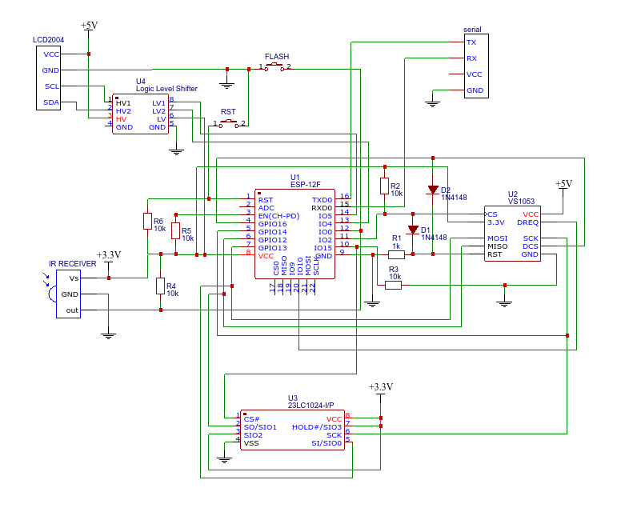

# Esp-radio
Internet radio based on ESP8266 and VS1053.  
This fork is optimised for Platformio and replaced ILI9163C display with LCD2004

### NOTES:
- The radio will NOT play AACP streams.
- Connection between LCD2004 and ESP8266 goes through level shifter,
  which is not demonstrated on wiring diagram

### Features:
- Can connect to thousands of Internet radio stations that broadcast MP3 or OGG audio streams.
- Can connect to a standalone mp3 file on a server.
- Can connect to a local mp3 file on LittleFS.
- Support for .m3u playlists.
- Uses a minimal number of components; no Arduino required.
- Handles bitrates up to 192 kbps.
- Has a preset list of maximal 100 favorite radio stations in configuration file.
- Configuration file can be edited through web interface.
- Can be controlled by a tablet or other device through a build-in webserver.
- Can be controlled over MQTT.
- Can be controlled over Serial Input.
- Can be controlled via Android app.
- Optional infra-red control support.
- The strongest available WiFi network is automatically selected.
- Heavily commented source code, easy to add extra functionality.
- Debug information through serial output.
- 20 kB ring buffer to provide smooth playback.
- Optional SPI RAM for larger buffer.
- LittleFS filesystem used for configuration of WiFi SSIDs, passwords and small MP3-files.
- Software update over WiFi possible (OTA).
- Saves volume and preset station over restart.
- Bass and treble control.
- Configuration also possible if no WiFi connection can be established.
- Can play iHeartRadio stations.

### Wiring

|  ESP-12F  |  VS1053  |  23LC1024  |  TSOP4838  |  LCD2004  |
|-----------|----------|------------|------------|------------
|  GPIO04   |          |            |            |    SDA    |
|  GPIO05   |          |            |            |    SCL    |
|  GPIO00   |          |            |    OUT     |           |
|  GPIO14   |   SCK    |    SCK     |            |           |
|  GPIO12   |   MISO   |  SO/SIO1   |            |           |
|  GPIO13   |   MOSI   |  SI/SIO0   |            |           |
|  GPIO16   |   DCS    |            |            |           |
|  GPIO02   |   DREQ   |            |            |           |
|  GPIO15   |   CS     |            |            |           |
|  GPIO10   |          |     CS     |            |           |

### Schematic

